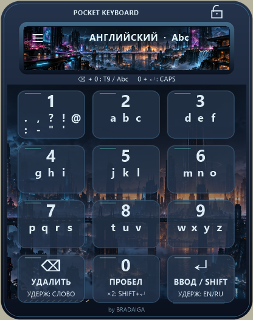

# Pocket Keyboard

**A compact keyboard for your mouse, NumPad and gamepad — by BRADAIGA.**

A tribute to classic phone keypads: 12 buttons, multi-tap and T9. A familiar way to type, now on Windows.

[Русский](README.md) · [Download for Windows](https://github.com/BRADAIGA/PocketKeyboard/releases/latest) · [Release history](https://github.com/BRADAIGA/PocketKeyboard/releases) · [Report a bug](https://github.com/BRADAIGA/PocketKeyboard/issues/new)

## Features

- Twelve-button text input using a mouse, NumPad, custom bindings or supported controllers.
- Six additional multi-tap layouts: Ukrainian, German, French, Spanish, Italian and Portuguese.
- Russian and English predictive T9, multi-tap input and a personal word dictionary.
- Optional on-screen input, hold actions and key combinations.
- Sixteen themes with search, filters, illustrated HD designs and animated scenes.
- Separate interface language and typing layout.
- Update checks and verified installer downloads, installed after confirmation.

## Install

Download **PocketKeyboard-Setup-…exe** from the [latest release](https://github.com/BRADAIGA/PocketKeyboard/releases/latest). The GitHub-generated “Source code” archives are not installers. Run Setup and optionally select a desktop shortcut. A Start menu shortcut is included.

Requires Windows x64. AutoHotkey is bundled; no separate installation is needed. Installation is per-user.

Open **Settings → Device and key bindings**. For a twelve-button mouse, assign F13–F24 in the manufacturer's software. NumPad uses physical positions: **7–8–9 / 4–5–6 / 1–2–3 / decimal–0–Enter**. Custom bindings are captured by selecting a field and pressing a device button. The **?** button opens a quick guide.

Some games and protected fields may reject software-generated input. Nonstandard HID support depends on the device driver.

## Updates and privacy

Open **Settings → Updates** to check manually or enable startup checks. New installers are downloaded from this repository and verified by size and SHA-256 before installation. The app restarts after updating.

Settings and learned dictionaries live in `%APPDATA%\PocketKeyboard` and survive updates and uninstallation. First launch can migrate an existing portable edition from the desktop folder `Клавиатура` if installed data does not exist yet.

Dictionaries work offline. Update checks contact GitHub; typed text and personal dictionaries are not uploaded. Living scenes are procedural animations, not gameplay videos.

This repository hosts installers, update manifests and documentation. See [THIRD-PARTY.md](THIRD-PARTY.md) for third-party components. Please include the application version, reproduction steps and error message when [reporting bugs](https://github.com/BRADAIGA/PocketKeyboard/issues).
